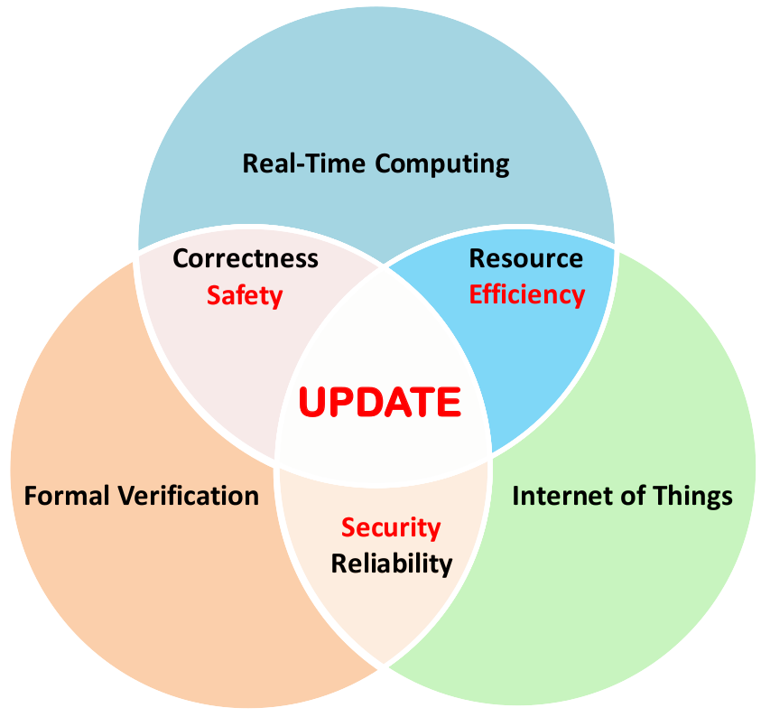

<a
href="https://kaw.wallenberg.org/nasta-generations-system-uppdatering-av-inbyggd-programvara">UPDATE</a>
is a five-year project funded by the <a
href="https://kaw.wallenberg.org/">Knut and Alice Wallenberg
Foundation</a> and hosted by <a href="https://www.it.uu.se">Uppsala
University</a>.

<!--

  <h1 class="page-heading">Posts</h1>

  <ul class="post-list">
    
      <li>
        {{ post.date | date: "%b %-d, %Y" }}

        <h2>
          <a class="post-link" href="{{ post.url | prepend: site.baseurl }}">{{ post.title }}</a>
        </h2>
      </li>
    
  </ul>

  
subscribe <a href="{{ "/feed.xml" | prepend: site.baseurl }}">via RSS</a>

-->